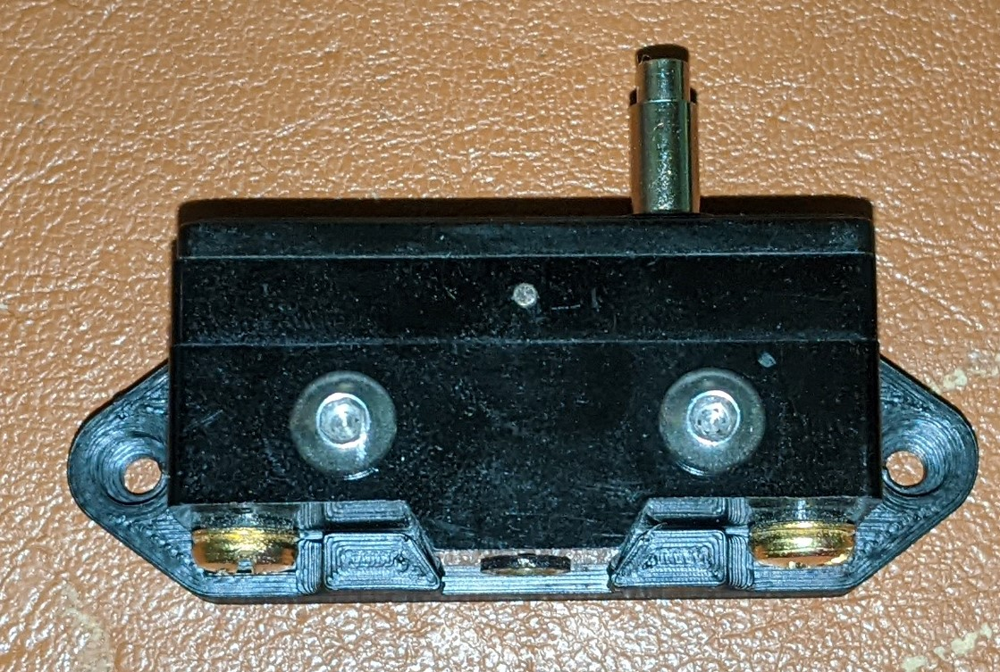
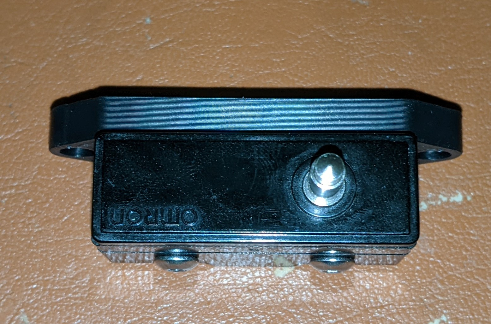
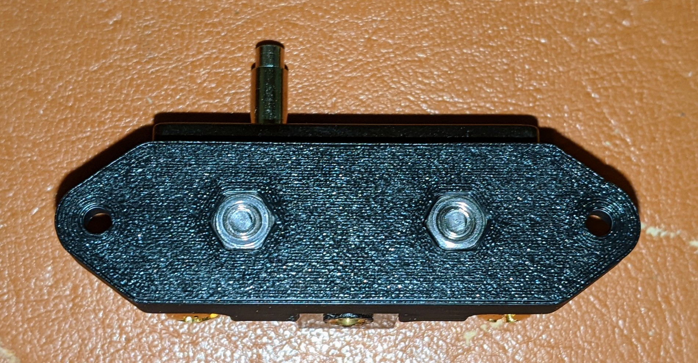
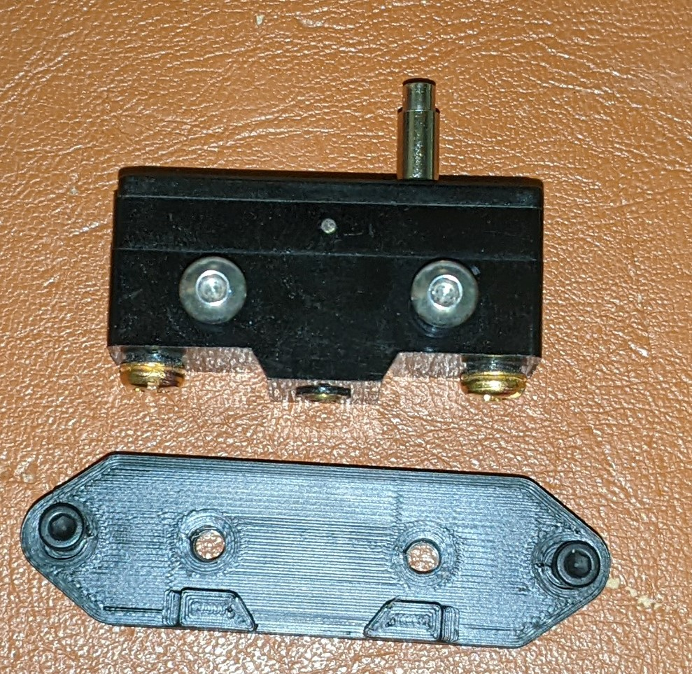

# Z-15GS-B-Mount

Designed a mounting bracket for the Omron Z-15GS-B endstop switch:

[Omron Z-15GS-B](https://www.ia.omron.com/product/item/9727/)

Available through your favorite Voron vendors:

[DFH Z-15GS-B](https://deepfriedhero.in/products/omron-automation-z-15gs-b)

The mount is designed to fit the switch onto a stock Voron 2.4, with the trigger pin set just above the print surface.

If you have a Kinematic mount, or a thicker bed plate, then the pin can be extended with some brass tubing and brass rod. 

More on that later...

---
## Files

[CAD](./CAD/)

[STL](./STL/)

---
## Print Settings

Recommended:

* ABS
* 0.4mm nozzle & wall width.
* 4 Walls
* 5 Solid Top/Bottom Layers
* Infill: Cubic, 50%

---
## Parts

Required parts for assembly:

* 2 x M4 BHCS/SHCS, 25mm long
* 2 x M4 nuts.
* 2 x M3 SHCS, 8mm long.
* 2 x M3 roll-in nuts, or T-nuts if you're... nuts.
* Wire and terminals to attach to the COM and NC screws.

---
## Assembly

1. Remove the center screw from the switch. You won't need it, and it will get in the way.
2. Insert 2 x M4 nuts in the back. Optionally cover with tape to keep them in.
3. Attach the switch to the plate, with the pin either on the left side or the right side. The pin side should be closest to the back edge of the bed.
4. Insert the 2 x M4 BHCS screws through the holes in the switch, thread into the nuts and tighten.
5. Attach the endstop wires to the COM and NC screws if you haven't already.
6. Insert the 2 x M3 SHCS 8mm screws into the holes in the plate.
7. Insert the M3 roll-in nuts in the extrusion, attach the plate to the extrusion and tighten.

---
## Pictures

Front

Top

Back

Assembly
